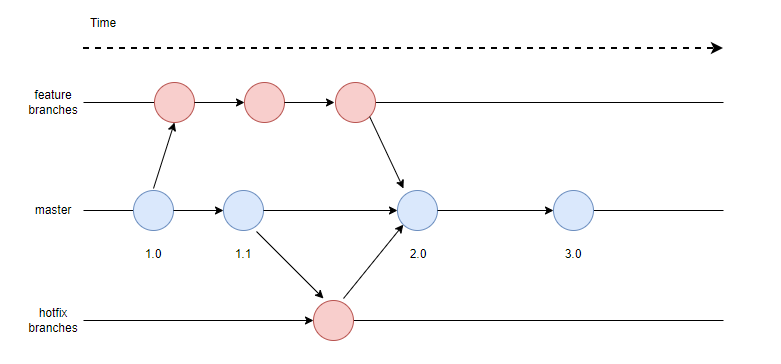

# 代码贡献流程

## 方法一：个人分支提交代码

1. 存在三种分支：feature分支、master分支和hotfix分支
  - **master**：发布分支
  - **feature-.\***：需求开发分支
  - **hotfix-.\***：热修复分支

2. **master**为长期分支，**feature-.\***和**hotfix-.\***为临时分支，开始开发时从**master**创建，完成后合并入**master**，分支消亡
3. 每次发布会在**master**上创建Tag，发布与Tag一一对应

## 提交代码

在个人分支完成代码后，推送代码到个人远程分支

## 发起合并请求

个人分支先rebase到master分支，如果有冲突先解决冲突，解决完冲突后在codehub代码网页上发起合并到master分支请求

## 跨区问题解决方案

由于该代码仓托管在通用区，黄区和绿区的提交可能因为安全策略受限，直接提交代码遇到下面的问题
`{"status": false, "message":"Security strategy checks failed: no cross-area rights. Tips: No cross-area permission. Access data: [52, 51, 2, 3] 安全策略检验失败: 没有跨区权限，说明：没有跨区权限"}`

需要使用Git MR来提交代码。git-mm提供了华为代码平台的多仓库的装配与集中式工作流，不使用Fork工作流。

## 方法二：使用 Git MR 提交代码

### Git MM工具安装

[参考文档](https://wiki.huawei.com/domains/71394/wiki/112070/WIKI202407304166066)

### 使用Git MR 提交代码

本地修改代码执行 `git commit -m '提交描述'` 准备推送，执行 `git review` 或 `git mr` 命令，在网页中打开命令执行后生成的MR地址

- 更多参考 https://openx.huawei.com/communityHome/postDetail?postId=3180&id=32

## 门禁说明
